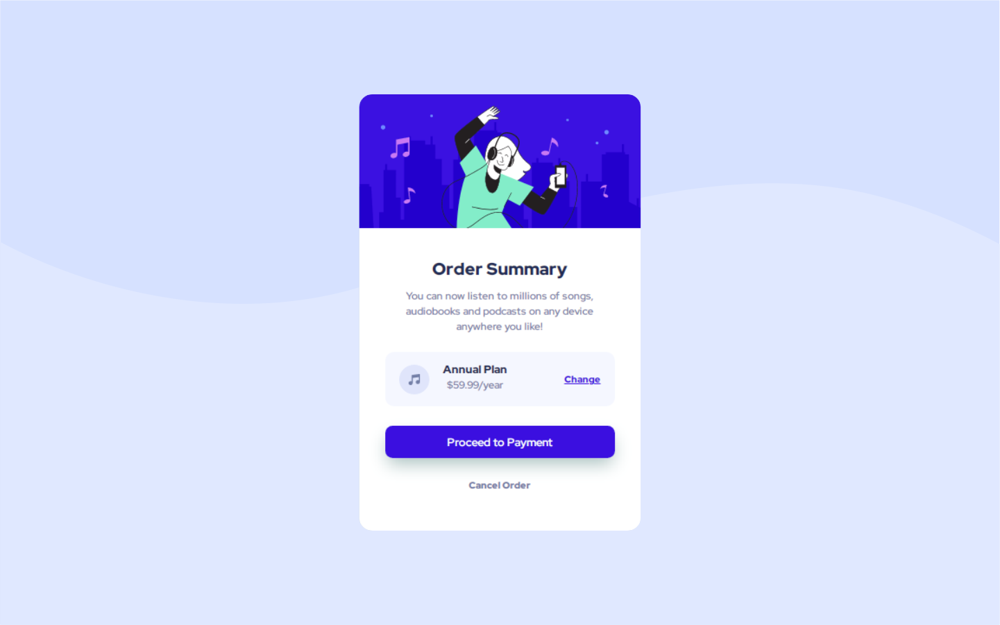

# Frontend Mentor - Order summary card solution

This is a solution to the [Order summary card challenge on Frontend Mentor](https://www.frontendmentor.io/challenges/order-summary-component-QlPmajDUj). Frontend Mentor challenges help you improve your coding skills by building realistic projects.

## Table of contents

- [Overview](#overview)
  - [Screenshot](#screenshot)
  - [Built with](#built-with)
  - [Some thoughts](#some-thoughts)
- [Author](#author)
- [Acknowledgments](#acknowledgments)

## Overview

This challenge is about a card of sort of purchase, that have, it was important because challenges me to find the best solution for the project.

### Screenshot

### Built with

- HTML5 markup
- Flexbox
- Grid
- Variables
- MediaQuery

### Some thoughts

This challenge was important for me, because i becoming proficent more and more with the projects.

## Author

- GitHub - [Francisco Prado](https://github.com/franciscoprado4)
- Frontend Mentor - [@yourusername](https://www.frontendmentor.io/profile/FranciscoPrado04)

## Acknowledgments

Thanks to frontent mentor for providing this great tool for improving.
